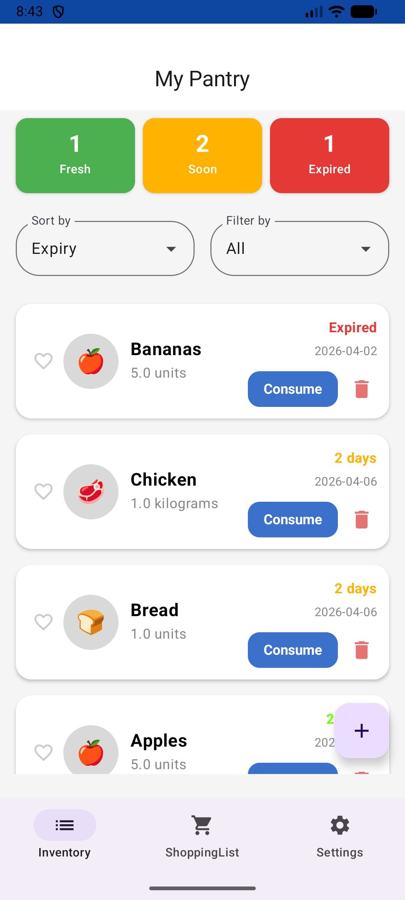

# **FoodManager**

### **Description**

FoodManager is an app that helps households manage their pantry and grocery shopping in one shared place. It tracks expiry dates with different colour warnings, keeps the shared inventory updated in real time, and makes it easy to restock products directly from the pantry to the shopping list.

**Team 102-13**

Our team consists of 4 members: 

- Javier Mascareña Gonzalez j2mascar@uwaterloo.ca
- Álvaro del Cañizo Angurel adelcani@uwaterloo.ca
- Jiawei Xu j695xu@uwaterloo.ca
- Sandra Perez Bueno sperezbu@uwaterloo.ca

Acknowlegdments: 

- [Compose Multiplatform / Jetpack Compose](https://www.jetbrains.com/compose-multiplatform/)
- [Material 3 for Compose](https://developer.android.com/develop/ui/compose/designsystems/material3)
- [AndroidX Activity Compose](https://developer.android.com/jetpack/androidx/releases/activity)
- [AndroidX Lifecycle Compose](https://developer.android.com/jetpack/androidx/releases/lifecycle)
- [AndroidX Navigation Compose](https://developer.android.com/develop/ui/compose/navigation)
- [Kotlinx Serialization](https://github.com/Kotlin/kotlinx.serialization)
- [Kotlinx Datetime](https://github.com/Kotlin/kotlinx-datetime)
- [Kotlinx Coroutines](https://github.com/Kotlin/kotlinx.coroutines)
- [Supabase Kotlin](https://supabase.com/docs/reference/kotlin/introduction)
- [Ktor Client](https://ktor.io/)
- [JUnit](https://junit.org/junit4/)
- [Kotlin Official Documentation](https://kotlinlang.org/docs/home.html)

### **Project Information**

Our [Team Contract](https://git.uwaterloo.ca/j2mascar/mobileapplications/-/wikis/Team-Contract) explains how the team is expected to work together.

Our [Project Proposal](https://git.uwaterloo.ca/j2mascar/mobileapplications/-/wikis/Project-Proposal) describes the main goals and structure of the project.

Our [Team Meeting Minutes](https://git.uwaterloo.ca/j2mascar/mobileapplications/-/wikis/Meeting-Minutes) summarize what was discussed in each meeting.

Our [Team Reflections](https://git.uwaterloo.ca/j2mascar/mobileapplications/-/wikis/Team-Reflections) describe the team's journey with this project.

### **User Guide**

Our [User Guide](https://git.uwaterloo.ca/j2mascar/mobileapplications/-/wikis/User-Guide) contains information on how to install the app and how to navigate through it.

### **Design Documents**

Our [Design Diagrams & Patterns](https://git.uwaterloo.ca/j2mascar/mobileapplications/-/wikis/Design-Diagrams) page includes the UML Class Diagram of the app's architecture and the software design patterns implemented (MVVM, Repository, Use Case).

Our [Database Schema (ERD)](https://git.uwaterloo.ca/j2mascar/mobileapplications/-/wikis/Database-Schema) includes the Mermaid.js code and diagram for our Supabase relational structure.

### **Grading Instructions**

Our [Grading Instructions](https://git.uwaterloo.ca/j2mascar/mobileapplications/-/wikis/Grading-Instructions) contains information on using the app, such as users to make it easier to test the app.

### **Milestones**

Our milestone for [Sprint 1](https://git.uwaterloo.ca/j2mascar/mobileapplications/-/milestones/2) is included here.

Our milestone for [Sprint 2](https://git.uwaterloo.ca/j2mascar/mobileapplications/-/milestones/3) is included here

Our milestone for [Sprint 3](https://git.uwaterloo.ca/j2mascar/mobileapplications/-/milestones/4) is included here

Our milestone for [Sprint 4](https://git.uwaterloo.ca/j2mascar/mobileapplications/-/milestones/5) is included here

### **Release Notes**

[Release Notes Version 1.0.0](https://git.uwaterloo.ca/j2mascar/mobileapplications/-/wikis/Release-Notes---Version-1.0.0) can be found here